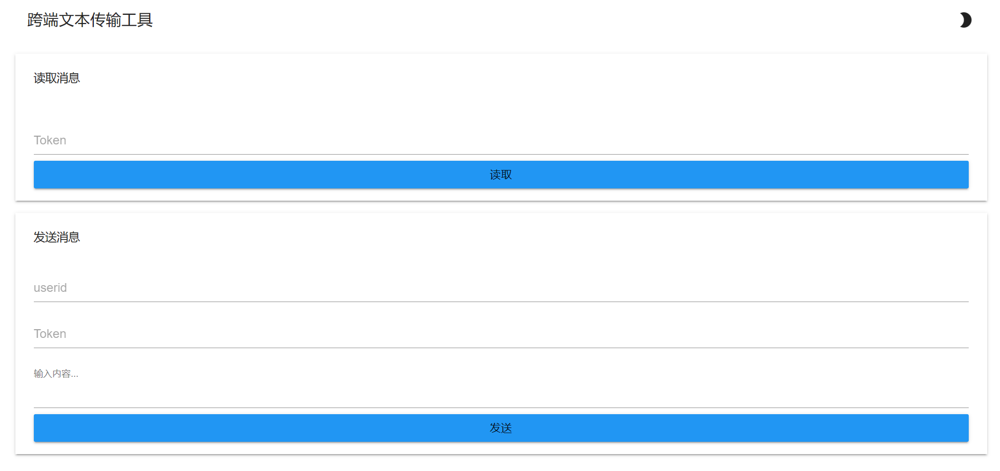

# 跨端文本传输工具
本工具适用于个人或小团体跨设备传输并分享文本，使用GO编写，最初设计用于将个人ChromeBook上的文本快速传送到别的设备上，需要拥有自己的服务器。
## 特点
* 部署简单，可通过docker直接编译并部署。
* 无额外依赖，文本和配置全部直接使用文件存储，无需数据库。
* 使用简单，访问网页，输入消息token即可快速读取文本，无需进行登录等额外操作。

## 部署方式
项目默认监听80端口，推荐使用docker compose模板编排，以下是一个示例：
```
  gotextsharer:
    command: ./main
    build:
      context: ./goshare/build # 将项目文件放于此处以进行编译
    restart: unless-stopped
    volumes:
      - ./goshare/message:/app/message
      - ./goshare/config:/app/config
    ports:
      - 80:80 # 也可通过nginx等进行反代
```
然后使用
```
docker compose up gotextsharer --build -d
```
进行构建。

也可以直接编译使用：
```
go build .
```
## 使用方式
1. 访问```部署地址/setup```进行初始用户和管理员密码设置。

2. 在主页发送消息面板输入userid,任意消息token以及文本进行发送。

3. 在主页读取消息面板输入token进行读取或访问```部署地址/s/消息token```读取文本

## TODO
- [x] 简易日志系统和多用户系统
- [ ] 消息索引
- [ ] 更完善的消息读取机制
- [ ] 完善的PWA应用
## 致谢
- [@bbaa](https://github.com/bbaa-bbaa) 技术支持/功能建议

- [MDUI](https://github.com/zdhxiong/mdui) 前端框架
- [xxhash](https://github.com/cespare/xxhash/) 用go实现的xxhash库
